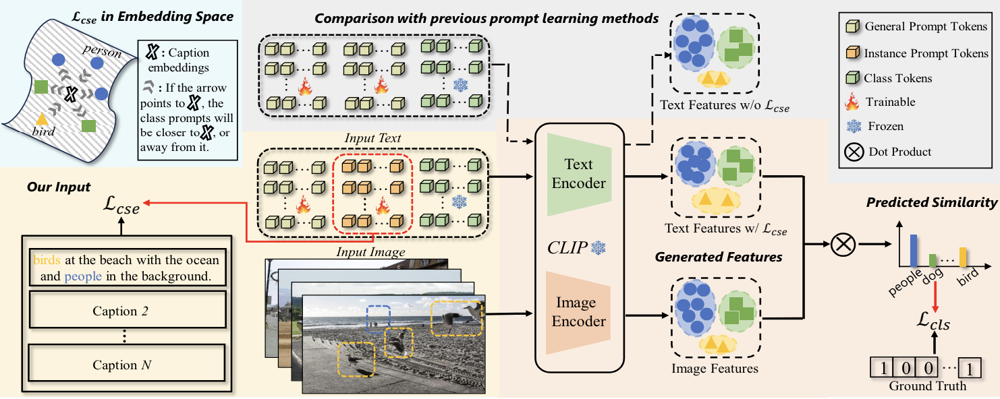

# LMPT

<!-- 
[](https://paperswithcode.com/sota/long-tail-learning-on-coco-mlt?p=maple-multi-modal-prompt-learning)
[](https://paperswithcode.com/sota/long-tail-learning-on-coco-mlt?p=maple-multi-modal-prompt-learning)
-->

## 👀Introduction

This repository contains the code for our paper `LMPT: Prompt Tuning with Class-Specific Embedding Loss for Long-tailed Multi-Label Visual Recognition`.[[arXiv]](https://arxiv.org/abs/2305.04536) 

LMPT explores the feasibility of prompting with text data for long-tailed multi-label visual recognition. We propose a unified framework for LTML, namely prompt tuning with class-specific embedding loss (LMPT), capturing the semantic feature interactions between categories by combining text and image modality data and improving the performance synchronously on both head and tail classes. Specifically, LMPT introduces the embedding loss function with class-aware soft margin and re-weighting to learn class-specific contexts with the benefit of textual descriptions (captions), which could help establish semantic relation ships between classes, especially between the head and tail classes. Notable improvements are observed compared to several visual, zero-shot and prompt tuning methods on two long-tailed multi-label benchmarks. For more details please see the [paper](https://arxiv.org/pdf/2305.04536).

Created by [Peng Xia](https://peng-xia.site/), [Di Xu](https://scholar.google.com/citations?user=218NmBMAAAAJ), [Lie Ju](https://mmai.group/peoples/julie/), [‪Ming Hu‬‬](https://minghu0830.github.io/), [Jun Chen](https://junchen14.github.io/) and [Zongyuan Ge](https://zongyuange.github.io/).



## 💡Requirements

### Environment

1. Python 3.8.*
2. CUDA 11.6
3. PyTorch 
4. TorchVision 

### Install

Create a  virtual environment and activate it.

```shell
conda create -n lmpt python=3.8
conda activate lmpt
```

The code has been tested with PyTorch 1.13 and CUDA 11.6.

```shell
pip install -r requirements.txt
```

## ⏳Dataset

To evaluate/train our LMPT network, you will need to download the required datasets. Image paths, labels and captions of each dataset can be found [here](https://github.com/Richard-peng-xia/LMPT/data).

* [COCO-LT](https://github.com/wutong16/DistributionBalancedLoss/tree/master/appendix/coco)

* [VOC-LT](https://github.com/wutong16/DistributionBalancedLoss/tree/master/appendix/VOCdevkit)

```Shell
├── data
    ├── coco
        ├── train2017
            ├── 0000001.jpg
            ...
        ├── val2017
            ├── 0000002.jpg
            ...
        ├── coco_lt_train.txt
        ├── coco_lt_val.txt
        ├── coco_lt_test.txt
        ├── coco_lt_captions.txt
        ├── class_freq.pkl
    ├── voc
        ├── VOCdevkit
            ├── VOC2007
                ├── Annotations
                ├── ImageSets
                ├── JPEGImages
                    ├── 0000001.jpg
                    ...
                ├── SegementationClass
                ├── SegementationObject
            ├── VOC2012
                ├── Annotations
                ├── ImageSets
                ├── JPEGImages
                    ├── 0000002.jpg
                    ...
                ├── SegementationClass
                ├── SegementationObject
        ├── voc_lt_train.txt
        ├── voc_lt_val.txt
        ├── voc_lt_test.txt
        ├── voc_lt_captions.txt
        ├── class_freq.pkl
```

## 📦Usage

### Train

```bash
CUDA_VISIBLE_DEVICES=0 python lmpt/train.py \
--dataset 'voc-lt' \
--seed '0' \
--pretrain_clip 'ViT16' \
--batch_size 64 \
--epochs 50 \
--class_token_position 'end' \
--ctx_init '' \
--n_ctx 16 \
--m_ctx 2 \
--training_method 'lmpt' \
--lr 5e-4 \
--loss_function dbl \
--cseloss softmargin \
--optimizer sgd \
--neg_scale 2.0 \
--gamma 0.2 \
--lam 0.5
```

### Test

```bash
CUDA_VISIBLE_DEVICES=0 python lmpt/test.py \
--dataset 'voc-lt' \
--seed '0' \
--pretrain_clip 'ViT16' \
--batch_size 64 \
--class_token_position 'end' \
--ctx_init 'a photo of a' \
--training_method 'lmpt' \
--thre 0.3
```

### Zero-Shot CLIP

```bash
CUDA_VISIBLE_DEVICES=0 python zero_shot_clip/test.py \
--dataset 'VOC' \
--nb_classes 20 \
--seed '0' \
--pretrain_clip_path '../pretrained/RN50.pt' \
--dataset 'COCO'
--batch_size 64 \
```

### Fine-Tuning CLIP

```bash
CUDA_VISIBLE_DEVICES=0 python finetune_clip/fc.py \
--dataset 'voc-lt' \
--nb_classes 20 \
--seed '0' \
--batch_size 4 \
--pretrain_clip_path '../pretrained/ViT-B-16.pt' \
--dataset 'voc-lt'
--batch_size 100 \
#--from scratch
```

## 🙏Acknowledgements

We use code from [CoOp](https://github.com/KaiyangZhou/CoOp) and [CLIP](https://github.com/openai/CLIP). We thank the authors for releasing their code.

## 📧Contact

If you have any questions, please create an issue on this repository or contact at [richard.peng.xia@gmail.com](mailto:richard.peng.xia@gmail.com) or [julie334600@gmail.com](mailto:julie334600@gmail.com).

## 📝Citing

If you find this code useful, please consider to cite our work.

```
@article{xia2023lmpt,
  title={LMPT: Prompt Tuning with Class-Specific Embedding Loss for Long-tailed Multi-Label Visual Recognition},
  author={Xia, Peng and Xu, Di and Ju, Lie and Hu, Ming and Chen, Jun and Ge, Zongyuan},
  journal={arXiv preprint arXiv:2305.04536},
  year={2023}
}
```
